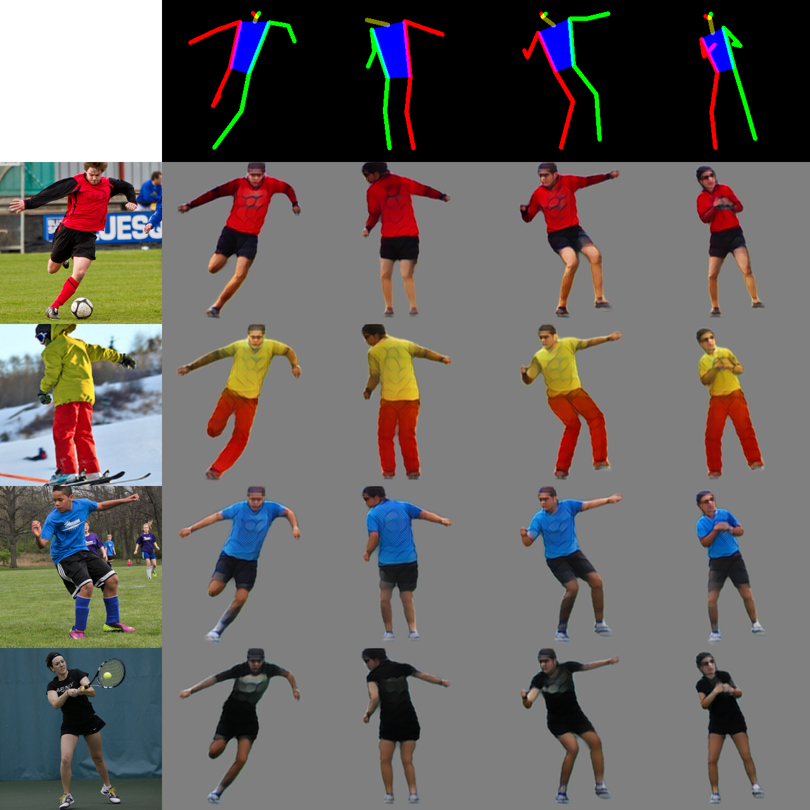

# A Variational U-Net for Conditional Appearance and Shape Generation

This repository contains code for the paper

**A Variational U-Net for Conditional Appearance and Shape Generation**

The model learns to infer appearance from a single image and can synthesize
images with that appearance in different poses.

## Other datasets

To be able to train the model on your own dataset you must provide a pickled
dictionary with the following keys:

- `joint_order`: list indicating the order of joints. 
- `imgs`: list of paths to images (relative to pickle file).
- `train`: list of booleans indicating if this image belongs to training split
- `joints`: list of `[0,1]` normalized xy joint coordinates of shape `(len(joint_jorder), 2)`. Use negative values for occluded joints.

`joint_order` should contain

    'ranke', 'rknee', 'rhip', 'rshoulder', 'relbow', 'rwrist', 'reye', 'lanke', 'lknee', 'lhip', 'lshoulder', 'lelbow', 'lwrist', 'leye', 'cnose'
